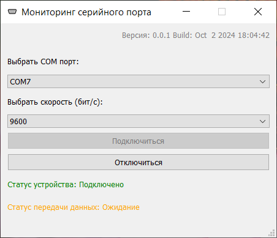

# Мониторинг серийного порта

Программа для тестирования чтения данных по RS-232 в Windows.

### Возможности:
- Выбор COM-порта и скорости передачи данных.
- Подключение и отключение устройства.
- Отображение статуса соединения и передачи данных.
- Автоопределение доступных портов.
- Обработка ошибок соединения.
